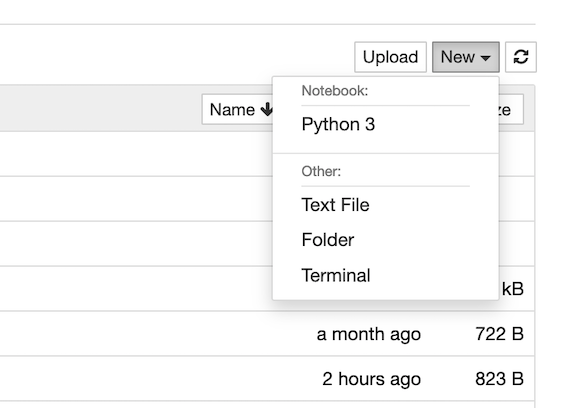
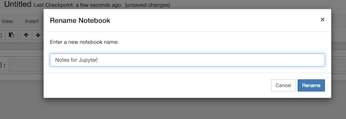
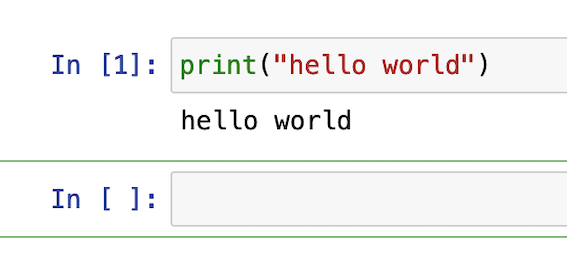

## Jupyter

Jupyter is an interactive environment that allows you to run code and document it as you go along. It supports Python by default but you can get it to run R and Julia as well. 

Jupyter is not installed with Python (unless you are using Anaconda where it is a default package). It can be installed through pip ```pip install jupyter``` or ```pip3 install jupyter```. 

Once installed and you have changed into the directory where you are working, it can be started using

```jupyter notebook```

You should see the homescreen. 



Open a new notebook from the screen options. I chose a Python 3 notebook. 

By default, the notebook is called "Untitled". If you click on it, you can change it to something meaningful. This also changes the filename to match it so it is helpful to find the notebook later. 



The notebook has cells inside it where code or text can be put. By default, each cell is a code cell but if you change code to markdown, you can enter text. Markdown is a markup language with many variants, but the [Markdown Guide](https://www.markdownguide.org/basic-syntax) provides some basic notation that is common. 

Add in the Python code to the cell and click run (or press shift & enter together). If the cell completes (it will have a number in it), it may print something. If it fails, it will print an error. 



